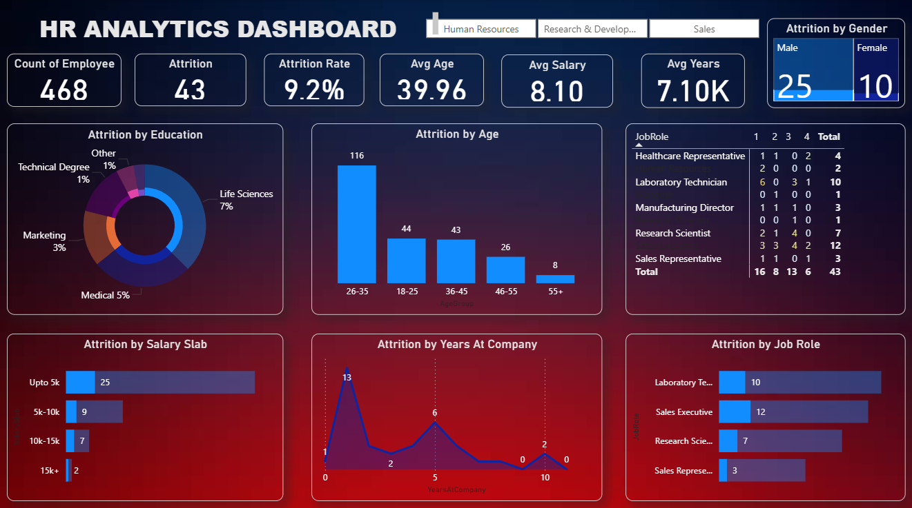

# HR Analytics Dashboard (Power BI)

📊 Dashboard created in **Power BI** to analyze employee attrition trends.  

## 🔹 Key Highlights
- Total Employees: 1470
- Attrition Rate: 9.2%
- Average Age: 39.96 years
- Average Salary: 6.5k

## 📷 Dashboard Preview

## 📄 Full Report
👉 [Download PDF](Power bi dashboard pdf.pdf)
